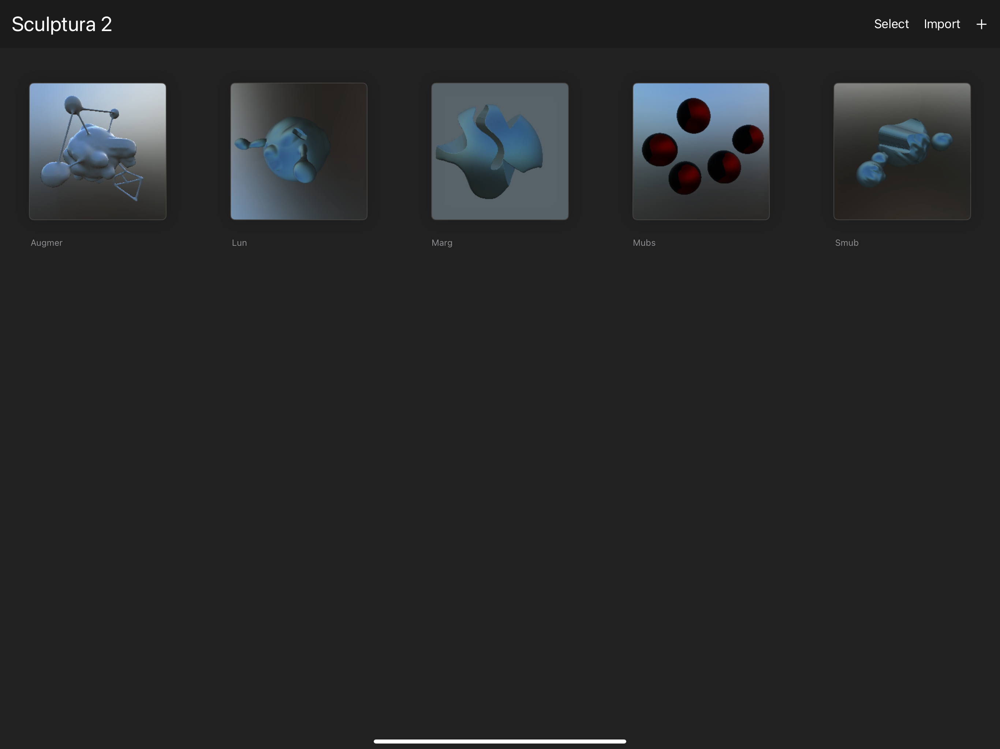

# FileBrowser

`UIDocumentBrowserViewController` (aka `DocumentGroup` in SwiftUI) is overwrought, buggy, is confused with the Files app, and forces you into having a title bar when opening a document. No wonder apps like Procreate make their own. This is an attempt to replicate the browser in Procreate.

This is far from complete, but I will be using it in both of my already-released apps and one upcoming app.



## Usage

```swift
         // @State var editing: URL?
         WindowGroup {
            ZStack {
                if let editing {
                    RootView(editing: $editing)
                } else {
                    FileBrowserView(editing: $editing,
                                    utType: UTType("com.yourcompany.yourformat")!
                                    pathExtension: "myextension",
                                    newDocumentURL: Bundle.main.url(forResource: "New Document", withExtension: "myextension")!)
                }
            }
        }
```
